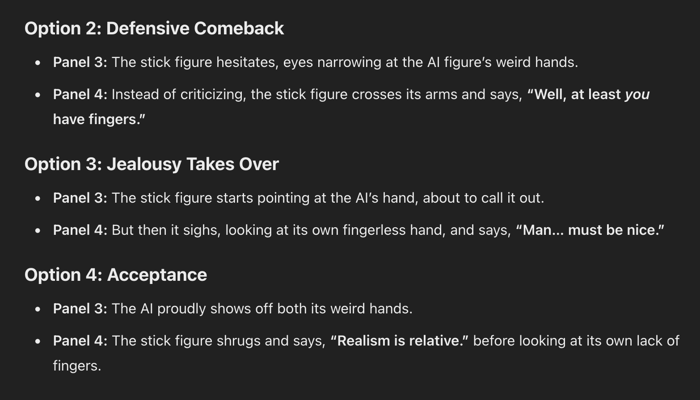
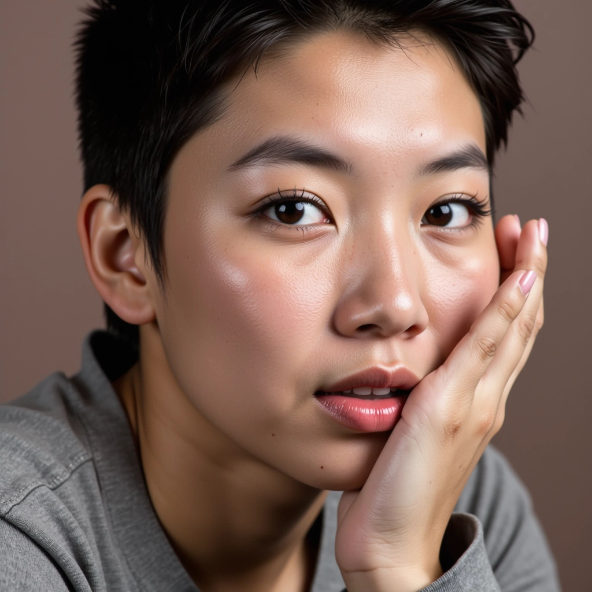
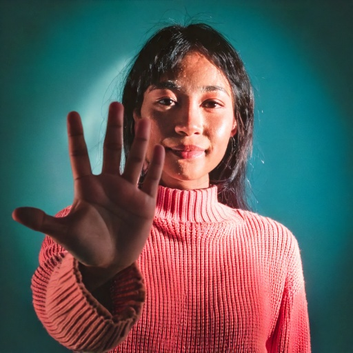

# Assignment01_4-Koma
Assignment 1, VIZA 626 Generative Art &amp; Design (Spring 2025)

<!-- Improved compatibility of back to top link: See: https://github.com/othneildrew/Best-README-Template/pull/73 -->

<!-- PROJECT SHIELDS -->
<!--
*** I'm using markdown "reference style" links for readability.
*** Reference links are enclosed in brackets [ ] instead of parentheses ( ).
*** See the bottom of this document for the declaration of the reference variables
*** for contributors-url, forks-url, etc. This is an optional, concise syntax you may use.
*** https://www.markdownguide.org/basic-syntax/#reference-style-links
-->

<!-- PROJECT LOGO -->
 

  </a>

  <h3 align="center">4-Comma: First Name: Ei | Last Name: Eye</h3>

  

    I created a four-panel yonkoma comic where a stick figure interacts with an AI-generated image that has actually has fingers. The humor      comes from the stick figure earnestly commenting on how realistic the AI image looks, oblivious to its glaring anatomical mistakes. They look down at their fingerless hands and realize that they can't really comment on what's real or not. 
     
    <a href="https://github.com/woumjai/Assignment01_4-Koma/blob/05457f40af5a264c95b8f2a12b95693420bd2b07/pdf First_Name_Ei_Last_Name_Eye.pdf"><strong>Link to PDF Report »</strong></a>
     
     
    <a href="https://carhua.myportfolio.com">Carolyn Hua</a>
    &middot;
    <a href="https://sites.google.com/view/viza626/home">VIZA 626</a>
  

Figure 1. This is my 4-comma. The idea is to understand that while AI is increasingly getting more realistic, it's still not real and that we as a user still need to understand that anything out of AI can be considered an interpertation on life. 

<!-- Abstract -->
## Abstract

This paper explores AI-generated errors through a case study of an image with a backwards hand, highlighting flaws in AI's pattern recognition and lack of common sense. These distortions emphasize the need for human oversight in AI-driven art to prevent misinformation and misplaced trust in automated outputs.

<!-- Introduction and Related Works -->
## Introduction and Related Works

As an artist, I constantly push myself to think beyond conventions and expand the boundaries of my work. However, with the rise of generative AI, maintaining authenticity has become increasingly challenging as AI blurs the line between human craftsmanship and machine production. Kate Crawford’s Atlas of AI explores how AI is not just a neutral tool but a system shaped by power, labor, and biases—raising concerns about its role in creative fields [1].

AI’s ability to replicate artistic styles often leads to bizarre distortions—such as extra fingers or unnatural anatomy—while raising questions about originality and artistic intent. Over time, I’ve observed AI evolve from a simple tool to a collaborator—or even an unintentional parody—of artistic expression.

Manga is an ideal medium to explore this tension because of its expressive visual language and ability to balance humor, drama, and critique. Through dynamic paneling, exaggerated expressions, and visual metaphors, I can highlight AI’s absurdities while emphasizing the irreplaceable human touch in art.

Using digital illustration tools like Adobe Photoshop alongside AI-assisted design programs, I aim to examine both the opportunities and flaws of AI-generated content. As Crawford argues, AI is deeply embedded in social and economic structures, making its impact on art an urgent and complex issue.

## Methodology

To achieve my artistic vision, I started by outlining my thoughts on Artificial Intelligence, focusing on how human critical thinking remains essential when working with AI. My goal was to highlight the tension between human creativity and AI-generated content, emphasizing the human touch through humor and exaggeration. I chose to explore this theme through yonkoma, a four-panel manga style known for its concise, impactful storytelling.

My process began with research on yonkoma’s structure, which helped me refine the narrative flow. I then created traditional sketches for the characters and composition, ensuring a strong foundation before incorporating AI. For dialogue, I used ChatGPT to iterate different conversation options that aligned with my theme of basic common sense. Additionally, I generated an AI image for one of the panels, intentionally engaging with its flaws. Interestingly, I had to prompt the AI to add extra fingers or wave its hand, as it often tried to obscure anatomical mistakes. By forcing these errors into the spotlight, I underscored the absurdity of AI-generated art and its limitations.

Ultimately, this project successfully reflected my vision by using manga to critique AI’s role in artistic authorship. If expanded, I would push the outlandishness further or explore deeper narratives challenging AI’s creative legitimacy.

Figure 2. ChatGPT responses for iteration on panel dialogue

Figure 3. OpenArt AI Result after asking for a human finger with more than 5 fingers

## Result and Future Work
Your Result and Future Work here: 100 words here.

The outcome of my project successfully reflected my vision by using manga to highlight the tension between human creativity and AI-generated content. The humor and exaggerated visuals effectively illustrated the absurdities of AI, like its anatomical mistakes, while emphasizing the human touch. If I were to do it again, I would focus on a different narrative that better addresses the topic or push the outlandishness of the subject further. The project could be expanded by exploring other mediums or incorporating deeper narratives that challenge AI’s role in artistic authorship and originality.

## Conclusion

This project highlighted AI’s struggles with anatomy, though extra fingers only appeared when explicitly prompted. The most memorable moment was crafting the stick figure’s oblivious reaction, emphasizing how AI errors can be subtle or exaggerated. This reinforced the need for critical awareness when integrating AI into creative work.

Figure 4. Adobe Firefly generated picture

<!-- Bibliography -->
## Bibliography 
[1] Crawford, Kate. Atlas of Ai : Power, Politics, and the Planetary Costs of Artificial Intelligence. Yale University Press, 2021. EBSCOhost,     search.ebscohost.com/login.aspx?direct=true&db=cat08680a&AN=tauc.EBC6478659&site=eds-live&scope=site.

<!-- CONTACT -->
## Contact

Carolyn Hua - chua@tamu.edu

Personal Website: [https://carhua.myportfolio.com](https://carhua.myportfolio.com/)

<!-- ACKNOWLEDGMENTS -->
## Acknowledgments

This work is submitted as part of Assignment 1 for the VIZA 626 course at Texas A&M University, under the instruction of Professor You-Jin Kim, during the Spring 2025 semester.

VIZA 626 Class Website: [https://sites.google.com/view/viza626/](https://sites.google.com/view/viza626/home)

<!-- MARKDOWN LINKS & IMAGES -->
<!-- https://www.markdownguide.org/basic-syntax/#reference-style-links -->
[contributors-shield]: https://img.shields.io/github/contributors/othneildrew/Best-README-Template.svg?style=for-the-badge
[contributors-url]: https://github.com/othneildrew/Best-README-Template/graphs/contributors
[forks-shield]: https://img.shields.io/github/forks/othneildrew/Best-README-Template.svg?style=for-the-badge
[forks-url]: https://github.com/othneildrew/Best-README-Template/network/members
[stars-shield]: https://img.shields.io/github/stars/othneildrew/Best-README-Template.svg?style=for-the-badge
[stars-url]: https://github.com/othneildrew/Best-README-Template/stargazers
[issues-shield]: https://img.shields.io/github/issues/othneildrew/Best-README-Template.svg?style=for-the-badge
[issues-url]: https://github.com/othneildrew/Best-README-Template/issues
[license-shield]: https://img.shields.io/github/license/othneildrew/Best-README-Template.svg?style=for-the-badge
[license-url]: https://github.com/othneildrew/Best-README-Template/blob/master/LICENSE.txt
[linkedin-shield]: https://img.shields.io/badge/-LinkedIn-black.svg?style=for-the-badge&logo=linkedin&colorB=555
[linkedin-url]: https://linkedin.com/in/othneildrew
[product-screenshot]: images/screenshot.png
[images-fig1]: images/fig1.png
[images-fig2]: images/fig2.jpg
[images-fig3]: images/fig3.jpg
[images-fig4]: images/fig4.png
[images-fig5]: images/fig5.png
[images-fig6]: images/fig6.png
[Next.js]: https://img.shields.io/badge/next.js-000000?style=for-the-badge&logo=nextdotjs&logoColor=white
[Next-url]: https://nextjs.org/
[React.js]: https://img.shields.io/badge/React-20232A?style=for-the-badge&logo=react&logoColor=61DAFB
[React-url]: https://reactjs.org/
[Vue.js]: https://img.shields.io/badge/Vue.js-35495E?style=for-the-badge&logo=vuedotjs&logoColor=4FC08D
[Vue-url]: https://vuejs.org/
[Angular.io]: https://img.shields.io/badge/Angular-DD0031?style=for-the-badge&logo=angular&logoColor=white
[Angular-url]: https://angular.io/
[Svelte.dev]: https://img.shields.io/badge/Svelte-4A4A55?style=for-the-badge&logo=svelte&logoColor=FF3E00
[Svelte-url]: https://svelte.dev/
[Laravel.com]: https://img.shields.io/badge/Laravel-FF2D20?style=for-the-badge&logo=laravel&logoColor=white
[Laravel-url]: https://laravel.com
[Bootstrap.com]: https://img.shields.io/badge/Bootstrap-563D7C?style=for-the-badge&logo=bootstrap&logoColor=white
[Bootstrap-url]: https://getbootstrap.com
[JQuery.com]: https://img.shields.io/badge/jQuery-0769AD?style=for-the-badge&logo=jquery&logoColor=white
[JQuery-url]: https://jquery.com 
